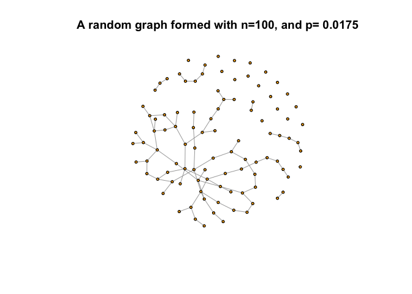
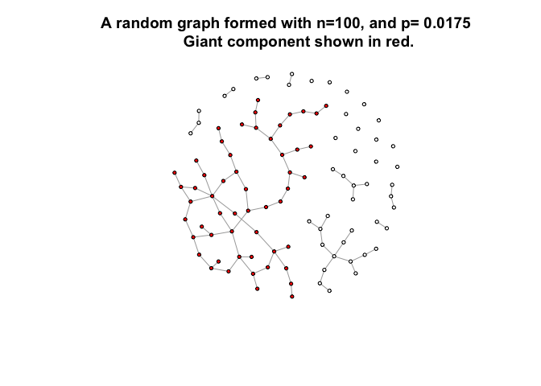
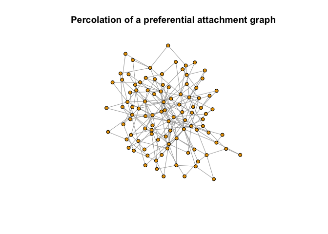
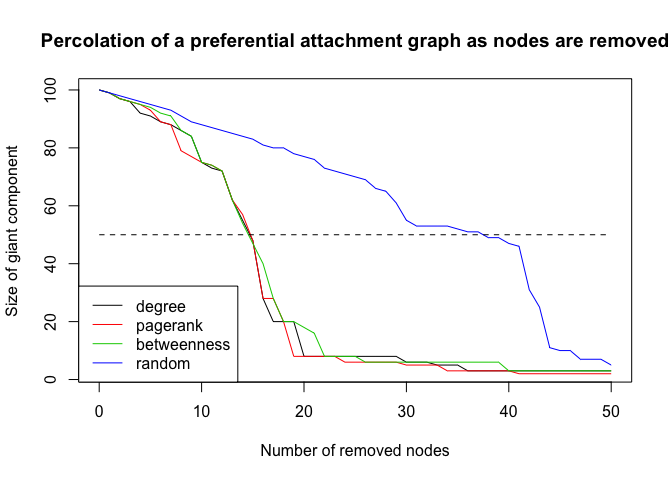
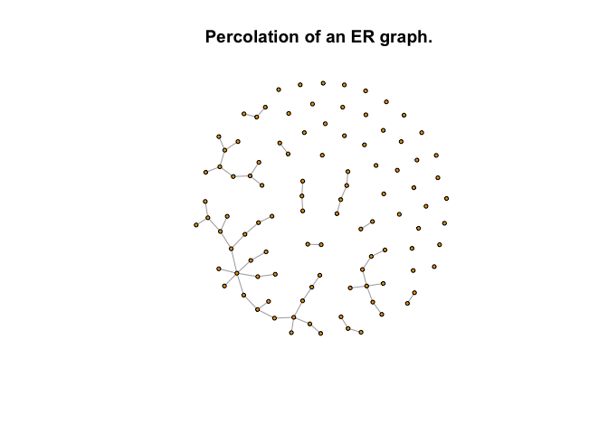
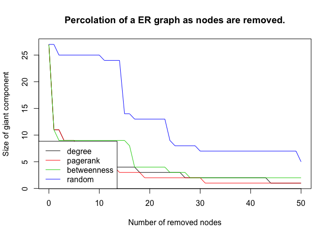
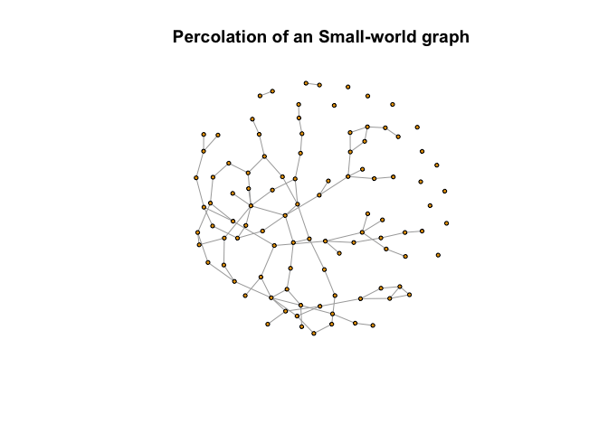
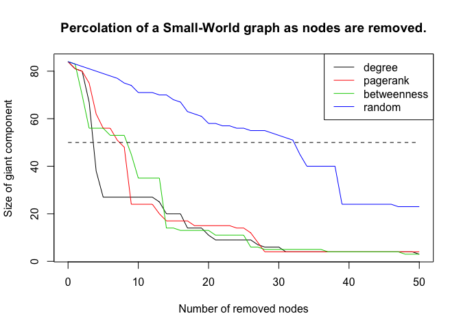

# An application of graph theory and percolation to the stock market. 

I use graph and percolation theory to model a group of market participants and the market breakdown after a critical mass of the participants decide to leave the market. I do not distinguish between buyers or sellers, i.e. I assume the decision of the market participant to buy or cell is not modelled but can be endogenous or exogenous.

Next, I simulate the connectivity of different graph types including random graphs and ER graphs. After a critical value of the number of links added between nodes, a giant component emerges. This can be seen in all types of graphs.

See percolation.md 


Random Network simulations
================
Andi Cupallari
1/15/2019

Percolation and resilience in random graphs.An Application to stock market percolation.
---------------------------------------------------------------------------------------

Percolation is a very important topic in many fields, originally developed for statistical physics applications. Percolation represents a paradigmatic model of a geometric phase transition. In the classical site percolation model, the sites of a square lattice are randomly occupied with particles with probability p, or remain empty with probability 1 − p. Neighboring occupied sites are considered to belong to the same cluster.

Percolation theory deals with the number and properties of these clusters. When the occupation probability p is small, the occupied sites are either isolated or form very small clusters. On the other hand, for large p there are a lot of occupied sites that have formed one large cluster. It is possible to find several paths of occupied sites which a walker can use to move from one side of the lattice to the other. In this latter case, it is said that a giant component of connected sites exists in the lattice. This infinite cluster as it is called does not appear in a gradual “linear” way with increasing **p**. It appears above a critical occupation probability **p<sub>c</sub>**.

When you click the **Knit** button a document will be generated that includes both content as well as the output of any embedded R code chunks within the document. You can embed an R code chunk like this:

I simulate a random graph with 100 nodes.

``` r
library(igraph)
n = 100
p = 1.75/n
g = sample_gnp(n, p)
coords = layout_with_fr(g)
```

The following random graph forms. I will further analyze this formed random graph, looking at different features of its components such as follows:

``` r
plot(g, layout=coords, vertex.size = 3, vertex.label=NA)
title(main = "A random graph formed with n=100, and p= 0.0175")
```



In the graph formed, a number of connected components is formed. Lets get the components of the random graph, and check if they are connected.

``` r
# get the components 
c = components(g)
# check if connected?
is_connected(g)
```

    ## [1] FALSE

``` r
# Number of components in the random graph  
c$no
```

    ## [1] 24

It turns out the random graphs is not connected, and it has 26 components. Let's checkthe size of each of this components.

``` r
c$csize
```

    ##  [1] 65  1  1  3  1  1  5  1  5  1  1  2  1  1  2  1  1  1  1  1  1  1  1
    ## [24]  1

Tabulate this:

``` r
table(c$csize)
```

    ## 
    ##  1  2  3  5 65 
    ## 18  2  1  2  1

Lets visualize the giant component. I color all the other nodes with white, and only the giant component’s nodes with red.



To track the evolution of the giant component in the graph, I define a function I call percolation that removes nodes from a graph and computes the size of the giant connected component as nodes are removed. My aim is to see how different network structures react differently to percolation, i.e. how does the size of the largest component change when nodes are removed.

``` r
# INPUT
# g: graph to percolate
# size: number of nodes to remove 
# d: removal vector
# OUTPUT
# giant: a vector with sizes of giant components when nodes are removed
percolate = function(g, size, d) {
  
  giant = vector()
  
  # initial size of giant component
  c = components(g)
  giant[1] = max(c$csize)
  
  names(d) = 1:length(d)
  d = sort(d, decreasing=TRUE)
  vital = as.integer(names(d[1:size]))
  
  for (i in 1:size) {
    c = components(delete_vertices(g, vital[1:i]))
    giant[i+1] = max(c$csize)
  }
  
  return(giant)
  
}
```

Percolation phenomena in different graph models.
------------------------------------------------

### Preferential attachment graph

``` r
g = sample_pa(n = 100, m = 2, directed=FALSE)
coords = layout_with_fr(g)
plot(g, layout=coords, vertex.label=NA, vertex.size = 5)
title('Percolation of a preferential attachment graph')
```



``` r
# resilience
size = vcount(g)/2
# random
rand = percolate(g, size, d = sample(V(g), size))    
# degree
deg = percolate(g, size, d = degree(g))    
# pagerank  
pr = percolate(g, size, d=page_rank(g)$vector)    
# betweenness
bet = percolate(g, size, d = betweenness(g))    

plot(0:size, deg, type = "l", col=1, xlab="Number of removed nodes", ylab="Size of giant component")
lines(0:size, pr, col=2)
lines(0:size, bet, col=3)
lines(0:size, rand, col=4)
lines(0:size, rep(vcount(g)/2, size+1), lty=2)
legend(x = "bottomleft", legend = c("degree", "pagerank", "betweenness", "random"), lty = 1, col = 1:4)
title('Percolation of a preferential attachment graph as nodes are removed')
```



### ER graph

``` r
g = sample_gnp(n=100, p=1/100)
coords = layout_with_fr(g)
plot(g, layout=coords, vertex.size = 3, vertex.label=NA)
title('Percolation of an ER graph. ')
```



``` r
# resilience
size = vcount(g)/2
# random
rand = percolate(g, size, d = sample(V(g), size))    
# degree
deg = percolate(g, size, d = degree(g))    
# pagerank  
pr = percolate(g, size, d=page_rank(g)$vector)    
# betweenness
bet = percolate(g, size, d = betweenness(g))    

plot(0:size, deg, type = "l", col=1, xlab="Number of removed nodes", ylab="Size of giant component")
lines(0:size, pr, col=2)
lines(0:size, bet, col=3)
lines(0:size, rand, col=4)
lines(0:size, rep(vcount(g)/2, size+1), lty=2)
legend(x = "bottomleft", legend = c("degree", "pagerank", "betweenness", "random"), lty = 1, col = 1:4)
title('Percolation of a ER graph as nodes are removed.')
```



### Small-world graph

``` r
n = 100
p =6/n
g <- sample_smallworld(1, n ,p, 0.5)
coords = layout_with_fr(g)
plot(g, layout=coords, vertex.size = 3, vertex.label=NA)
title('Percolation of an Small-world graph')
```



``` r
# resilience
size = vcount(g)/2
# random
rand = percolate(g, size, d = sample(V(g), size))    
# degree
deg = percolate(g, size, d = degree(g))    
# pagerank
pr = percolate(g, size, d=page_rank(g)$vector)    
# betweenness
bet = percolate(g, size, d = betweenness(g))    

plot(0:size, deg, type = "l", col=1, xlab="Number of removed nodes", ylab="Size of giant component")
lines(0:size, pr, col=2)
lines(0:size, bet, col=3)
lines(0:size, rand, col=4)
lines(0:size, rep(vcount(g)/2, size+1), lty=2)
legend(x = "topright", legend = c("degree", "pagerank", "betweenness", "random"), lty = 1, col = 1:4)
title('Percolation of a Small-World graph as nodes are removed.')
```


